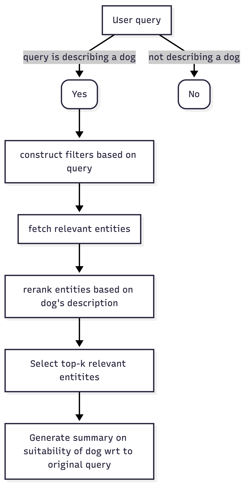

# 🐕 Adopt a Dog

Looking for a dog to adopt? This project is a recommendation service that suggests dogs available for adoption, based on a user's description for their ideal dog. The data is scraped from the Shenton Dog Refuge Home. Using Cohere, vector embeddings were created for each dog's description to find semantically similar dogs from the natural language query. The frontend was built with Vue and styled using TailwindCSS.

## Demo Video

[]

## Features

- ⁠[x] Input dog characteristics to get dog recommendations
- ⁠[x] Reranking search results with Cohere
- ⁠[x] Using Qwen3-32B model to provide explanations as to why a recommended dog matches a user's search
- ⁠[ ] Cron action to regularly update data
- ⁠[ ] Binary classification of query to detect if query is relevant to dog adoption
- ⁠[ ] Semantic caching of query to reduce usage of LLM calls

## How it works

- Users type in a query to describe the characteristics of a dog. Given that a user can type in anything (yes anything) into the search box, we want to first use binary classification to determine if a user's query is relevant. For instance, queries like 'dog that can fly' or 'where is the best place to get dog treats' is not relevant.
- Given that a user's query can have multiple requirements, we use an LLM to construct structured filters from the query to narrow down the search space.
- Then, we do an initial scan from the vector db to find conceptually similar matches. The retrieved items will go through a reranking process so we can return the top k results.
- We then use an LLM to summarize why a returned dog matches a user's search.

## Running the project locally

1. ⁠Clone this repo
2. Set up the backend by following `backend/README.md`
3. Set up the frontend by following `frontend/README.md`
4. ⁠Run ⁠`docker compose -f docker-compose.local up` or ⁠`docker compose -f docker-compose.local.cohere up` (depending on the model you choose) ⁠from the root directory (Make sure docker is installed)

## Learning and Challenges

1. ⁠Relying on pure semantic search is insufficient
2. Deployment
